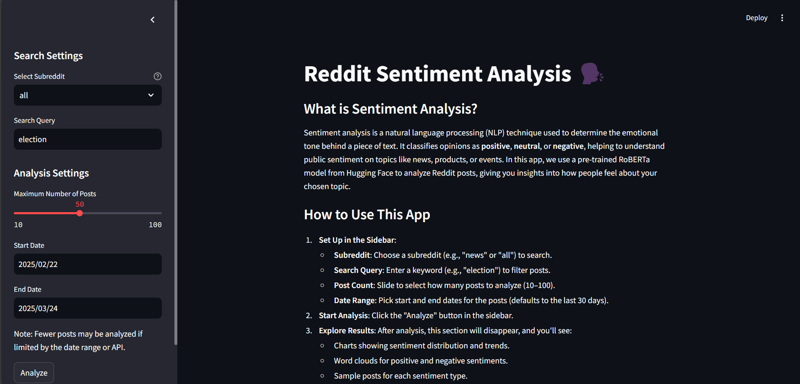
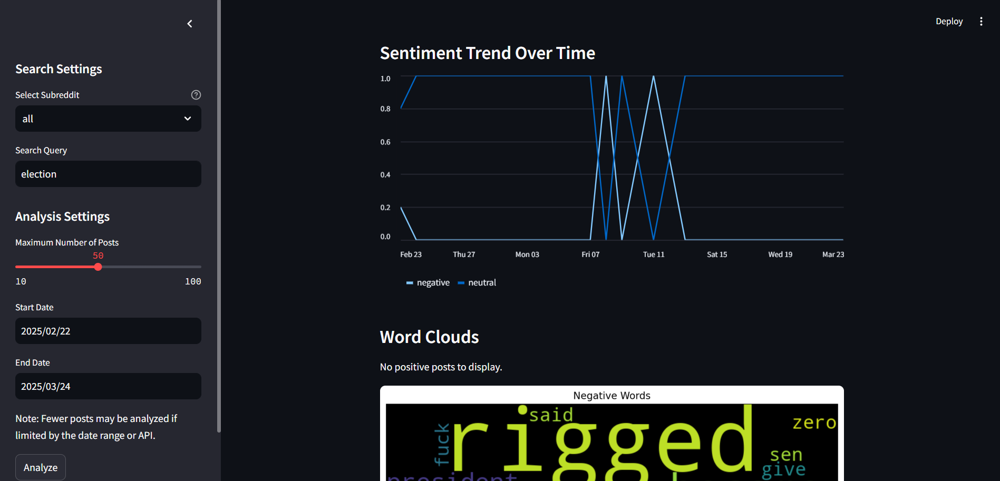

# Reddit Sentiment Analysis Dashboard 🗣️📊

  

## 🚀 Overview
The **Reddit Sentiment Analysis Dashboard** is a **Streamlit-based web application** that fetches Reddit posts, preprocesses text, and analyzes sentiment using a **Hugging Face RoBERTa model**. The app provides insightful **visualizations**, such as bar charts, pie charts, word clouds, and sentiment trends, along with the option to fetch **related news articles** via the News API.

## Live Demo 🚀  
Check out the live version of this app on Streamlit:  
👉 [Reddit Sentiment Analysis Dashboard]([https://your-streamlit-app-link.streamlit.app/](https://reddit-sentiment-analyzer-up5sdrnhsntf6olf2eknbt.streamlit.app/))  


## ✨ Features
✅ Fetch Reddit posts based on **subreddit, query, and date range**
✅ **Preprocess text** by removing URLs, stopwords, and lemmatizing words
✅ **Analyze sentiment** using Hugging Face's `cardiffnlp/twitter-roberta-base-sentiment` model
✅ **Visualize results** with bar charts, pie charts, and word clouds
✅ **Track sentiment trends over time**
✅ **View related news articles** from News API
✅ **Download the analyzed data** as a CSV file

## 🎥 Demo
### Dashboard Overview


### CHarts Overview



## 📦 Installation
### 1️⃣ Clone the Repository
```bash
git clone https://github.com/your-username/reddit-sentiment-analysis.git
cd reddit-sentiment-analysis
```

### 2️⃣ Install Dependencies
Ensure you have **Python 3.7+** installed, then run:
```bash
pip install -r requirements.txt
```

### 3️⃣ Set Up Environment Variables
Create a `.env` file and add your **Reddit API credentials** and **News API key**:
```ini
REDDIT_CLIENT_ID=your_client_id
REDDIT_CLIENT_SECRET=your_client_secret
REDDIT_USER_AGENT=your_user_agent
NEWS_API_KEY=your_news_api_key
```

### 4️⃣ Run the App
```bash
streamlit run app.py
```

## 📊 How It Works
1. **Fetch Reddit Posts**: Enter a query, select a subreddit, and define a date range.
2. **Analyze Sentiment**: The RoBERTa model classifies each post as **positive, neutral, or negative**.
3. **Visualize Data**: See sentiment distributions, word clouds, and trends.
4. **Fetch News Articles**: Get related news from **News API** (optional).
5. **Export Results**: Download the analysis as a CSV file.

## 🔧 Technologies Used
- **Streamlit** - Interactive UI
- **Pandas** - Data processing
- **Matplotlib & WordCloud** - Data visualization
- **PRAW (Python Reddit API Wrapper)** - Fetching Reddit posts
- **Hugging Face Transformers** - Sentiment analysis
- **News API** - Fetching related news articles
- **NLTK** - Text preprocessing (stopwords & lemmatization)

## 🛠️ Troubleshooting
**1. Sentiment model not loading?**  
Ensure PyTorch is installed:
```bash
pip install torch
```

**2. No Reddit posts found?**  
Try adjusting the query or increasing the date range.

**3. News API not working?**  
Check if you have a valid **NEWS_API_KEY** in your `.env` file.

## 📜 License
This project is licensed under the **MIT License**.

## 🤝 Contributing
Pull requests are welcome! Feel free to open an issue if you find bugs or want to request features.

---
Made with ❤️ by [Prateek Sahu](https://github.com/Prateeks16)

